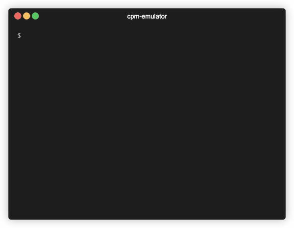

# CP/M emulator

This program runs CP/M 2.2 programs by emulating the BDOS and CBIOS on a modern Unix machine.

    % npm install
    % npm run build
    % node index.js --drive cpm-programs TURBO.COM

This presents the `cpm-programs` host directory as drive A:, loads `TURBO.COM` from within it, and
executes it. When `TURBO.COM` reads the `TURBO.MSG` file, it'll be read from the `cpm-programs`
directory. Be sure to resize your terminal window to 80x24. Configure programs to either
VT-100 or ANSI terminal sequences.

Status: Can run Sargon chess, the Zork series, WordStar, and Turbo Pascal. Only
the basic BDOS and CBIOS calls are implemented. If a program doesn't work for you,
enable logging (set `WRITE_LOG` to `true`) and look for `Error` messages indicating
which BDOS or CBIOS calls are missing.

# License

Copyright &copy; Lawrence Kesteloot, [MIT license](LICENSE).

